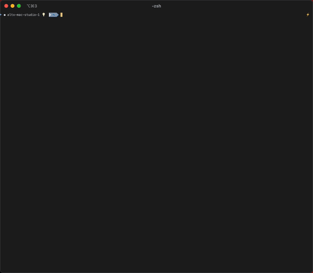
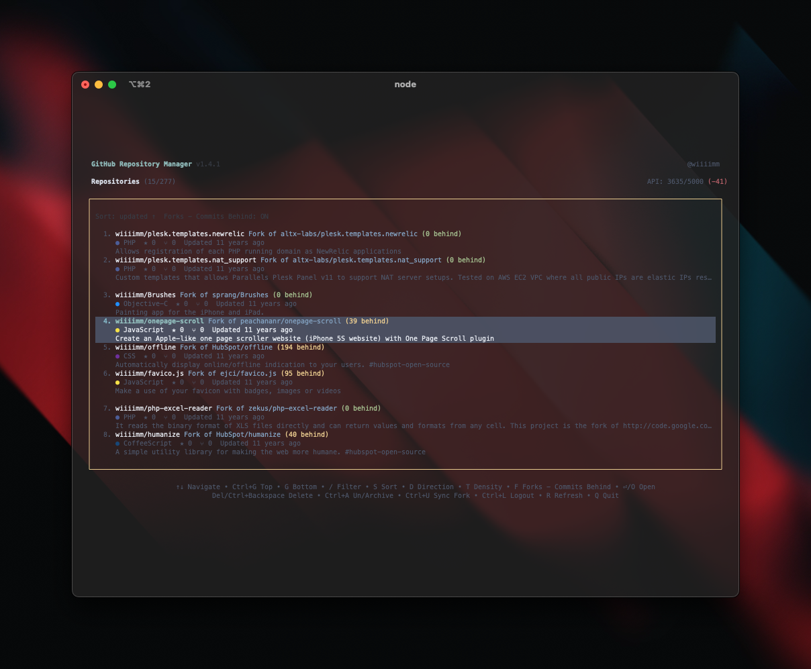
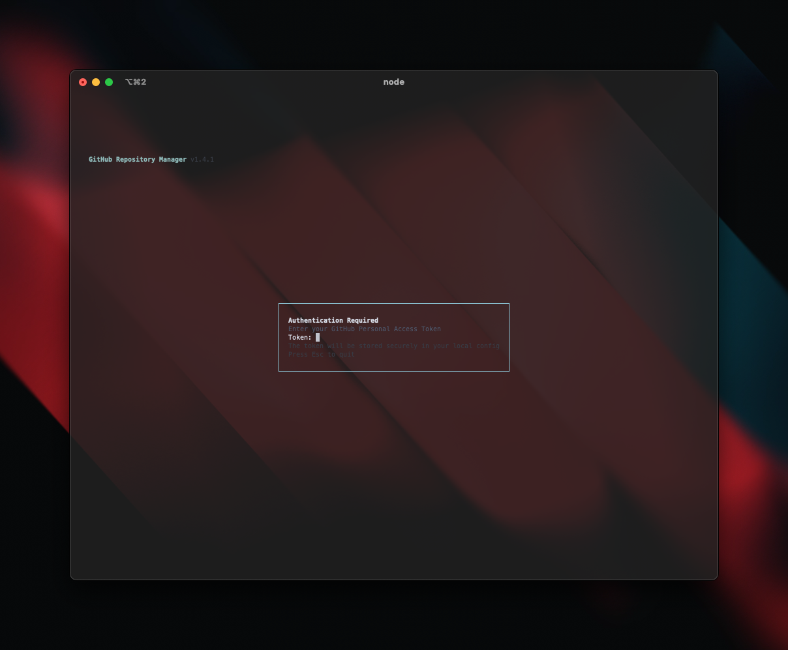
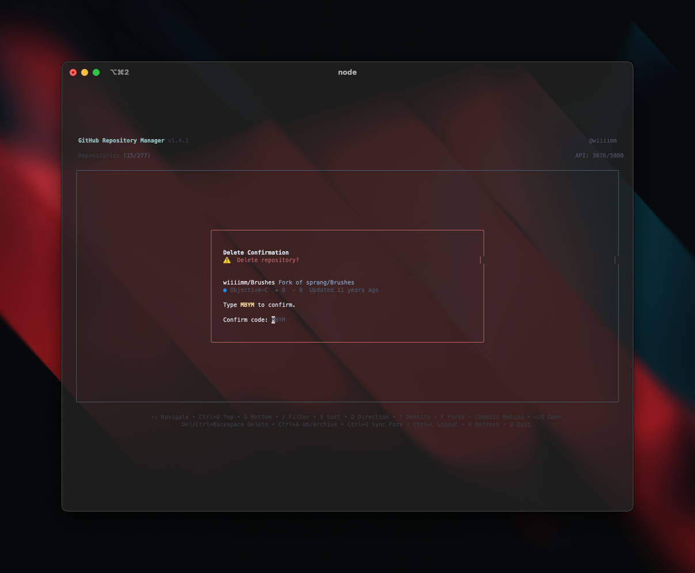

# gh-manager-cli

[](https://www.npmjs.com/package/gh-manager-cli)
[](https://github.com/wiiiimm/gh-manager-cli/releases)
[](https://opensource.org/licenses/MIT)
[](https://nodejs.org)
[](https://github.com/wiiiimm/gh-manager-cli/stargazers)
[](https://github.com/sponsors/wiiiimm)
[](https://www.anthropic.com)
[](https://openai.com)

Interactive terminal app to browse and manage your personal GitHub repositories. Built with Ink (React for CLIs) and the GitHub GraphQL API.

🌐 **Visit our website:** [gh-manager-cli.dev](https://gh-manager-cli.dev) | [Source](https://github.com/wiiiimm/gh-manager-cli-site)

## 🧹 Clean Up Your GitHub Account in Minutes

**Stop clicking through GitHub's slow web interface.** Managing dozens of repos on github.com means endless page loads, multiple clicks per action, and no keyboard shortcuts. 

`gh-manager-cli` replaces tedious web clicking with powerful terminal commands:

### ❌ GitHub Website Pain Points → ✅ Our Solution
- **Slow pagination** (page-by-page) → Whole account loaded in the background, browse and search everything instantly
- **Multiple clicks per action** → Single keypress for any operation  
- **No bulk operations** → Archive, delete, or modify multiple repos at once
- **Buried settings menus** → Direct keyboard shortcuts for everything
- **Page refresh after each action** → Instant updates with no reload

Perfect for:
- **Spring cleaning**: Archive old projects and delete forgotten forks
- **Professional profiles**: Keep only your best work visible  
- **Fork management**: Identify and sync outdated forks
- **Consistent naming**: Bulk rename repositories with patterns
- **Quick decisions**: See all metadata at a glance to decide what stays

<p align="center">
  
  <br />
  <em>Fast, keyboard-first GitHub repo management from your terminal</em>
 </p>

## Documentation

| Getting Started | Features | Development |
|-----------------|----------|-------------|
| [📥 Installation](wiki/Installation.md) | [🔍 Features Overview](wiki/Features.md) | [🛠️ Development Guide](wiki/Development.md) |
| [🔑 Token & Security](wiki/Token-and-Security.md) | [⌨️ Usage & Controls](wiki/Usage.md) | [🧪 Testing](wiki/Testing.md) |
| [❓ Troubleshooting](wiki/Troubleshooting.md) | [🗺️ Roadmap](wiki/Roadmap.md) | [🏠 Wiki Home](wiki/README.md) |

## Screenshots

<div align="center">
  
  
  
  <br />
  <sub>Listing • Auth • Delete confirmation</sub>
</div>

## Quick Start

```bash
# Run with npx (no install)
npx gh-manager-cli@latest
```

On first run, you'll be prompted to authenticate with GitHub (OAuth recommended).

## Features

### Core Repository Management
- **Authentication**: GitHub OAuth (recommended) or Personal Access Token with secure storage
- **Repository Listing**: Browse all your personal repositories with metadata (stars, forks, language, etc.)
- **Background Fetch-All**: Loads your entire account in the background after the first page, so filtering/sorting/search are instant and complete
- **Interactive Sorting**: Modal-based sort selection (updated, pushed, name, stars) with modal-based direction selection
- **Fuzzy Search**: Instant typo-tolerant search over the full cached repository set — no network calls in the search path (powered by [fuse.js](https://www.fusejs.io/))
- **Visibility Filter**: Modal-based visibility filter (All, Public, Private/Internal for enterprise) with smart filtering
- **Archive Filter**: Toggle-based archive filter (`A` key cycles All → Unarchived → Archived) for quick filtering by archive status
- **Fork Ahead/Behind Tracking**: After the background fetch-all completes, forks are enriched with both **ahead** and **behind** commit counts in a separate lightweight pass (batched 5 at a time to avoid rate-limit issues)
- **Stars Mode**: View and manage starred repositories (personal account only)
- **Repository Actions**:
  - View detailed info (`I`) - Shows repository metadata, language, size, and timestamps
  - Open in browser (Enter/`O`) — for forks a chooser lets you open this repo or the upstream
  - Jump to upstream (`P`) — moves cursor to the parent if loaded; otherwise fetches and shows it
  - Rename repository (`Ctrl+R`) with inline validation and automatic cache update
  - Copy repository URL to clipboard (`C`) with SSH/HTTPS options
  - Delete repository (`Del` or `Backspace`) with secure two-step confirmation
  - Archive/unarchive repositories (`Ctrl+A`) with confirmation prompts
  - Change repository visibility (`Ctrl+V`) - Switch between Public, Private, and Internal (enterprise only)
  - Star/unstar repositories (`Ctrl+S`) - Toggle star status for any repository
  - Sync forks with upstream (`Ctrl+F`) with ahead/behind counts and automatic conflict detection
- **Bulk Operations** (`M` to enter multi-select mode):
  - Select multiple repositories with `Space`
  - Run bulk delete, archive, or unarchive on all selected repos
  - Selections persist across search, filter, and sort changes (select from different searches, then bulk-act)
  - Two-step confirmation: review list with ability to unselect, then a count prompt before executing — bulk delete additionally requires typing a 4-character verification code
  - Per-repo progress reporting with partial-failure summary

### User Interface & Experience
- **Keyboard Navigation**: Full keyboard control (arrow keys, PageUp/Down, `Ctrl+G`/`G`)
- **Display Density**: Toggle between compact/cozy/comfy spacing (`T`)
- **Colour Themes**: Four themes (Default, Ocean, Forest, Monochrome) cycled with `Shift+T`, persisted across restarts
- **Visual Indicators**: Fork status, private/internal/archived badges, language colors, visibility status
- **Enterprise Support**: Full support for GitHub Enterprise with Internal repository visibility
- **Organization Context**: Switch between personal and organization accounts with ENT badge for enterprise orgs
- **Interactive Modals**: Sort selection, visibility filtering, organization switching, and visibility change dialogs
- **Balanced Layout**: Repository items with spacing above and below for better visual hierarchy
- **Loading States**: Contextual loading screens for sorting and refreshing operations
- **Rate Limit Monitoring**: Dual API rate limit display (GraphQL & REST) with real-time usage deltas and visual warnings

### Technical Features
- **Preference Persistence**: UI settings (sort, density, visibility filter, archive filter, fork tracking) saved between sessions
- **Server-side Filtering**: Visibility filtering performed at GitHub API level for accurate pagination
- **Cross-platform**: Works on macOS, Linux, and Windows
- **Secure Storage**: Token stored with proper file permissions (0600)
- **Error Handling**: Graceful error recovery with retry mechanisms
- **Performance**: Efficient GraphQL queries with virtualized rendering and server-side filtering
- **Comprehensive Logging**: Structured JSON logging with automatic rotation and configurable verbosity

## Installation

### Homebrew (macOS/Linux)

```bash
brew tap wiiiimm/tap
brew install gh-manager-cli
```

### NPX (Recommended - No Installation Required)

Run instantly without installing:

```bash
npx gh-manager-cli@latest
```

### NPM Global Install

Install globally for persistent `gh-manager-cli` command:

```bash
npm install -g gh-manager-cli@latest
gh-manager-cli
```

### Pre-built Binaries (No Node.js Required)

Download standalone executables from [GitHub Releases](https://github.com/wiiiimm/gh-manager-cli/releases):

- **Linux**: `gh-manager-cli-linux-x64`
- **macOS**: `gh-manager-cli-macos-x64` 
- **Windows**: `gh-manager-cli-windows-x64.exe`

Make the binary executable (Linux/macOS):
```bash
chmod +x gh-manager-cli-*
./gh-manager-cli-*
```

### From Source

Prerequisites:
- Node.js 18+
- pnpm

Install and build:

```bash
pnpm install
pnpm build
```

Run locally:

```bash
node dist/index.js
# Or add to PATH for dev
pnpm link
gh-manager-cli
```

## Authentication

The app supports two authentication methods:

### 1. GitHub OAuth (Recommended) 🎯

The easiest and most secure way to authenticate:

- **Device Flow**: No need to handle callback URLs - just enter a code on GitHub's website
- **Browser-based**: Opens GitHub's authorization page automatically
- **Secure**: No client secrets or sensitive data in the app
- **Full Permissions**: Automatically requests all necessary scopes for complete functionality
- **User-friendly**: No manual token management required

When you first run the app, select **"GitHub OAuth (Recommended)"** from the authentication options. The app will:
1. Display a device code for you to enter on GitHub
2. Open your browser to GitHub's device authorization page
3. Wait for you to authorize the app
4. Securely store the OAuth token for future use

### 2. Personal Access Token (PAT)

Alternative method for users who prefer manual token management:

- Provide via env var: `GITHUB_TOKEN` or `GH_TOKEN`, or enter when prompted on first run.
- Recommended: classic PAT with `repo` scope for listing both public and private repos.
- Validation: a minimal `viewer { login }` request verifies the token.

### Token Storage & Security

- Storage: tokens are saved as JSON in your OS user config directory with POSIX perms `0600`.
  - macOS: `~/Library/Preferences/gh-manager-cli/config.json`
  - Linux: `~/.config/gh-manager-cli/config.json`
  - Windows: `%APPDATA%\gh-manager-cli\config.json`
- Revocation: you can revoke tokens at any time in your GitHub settings.

Note: Tokens are stored in plaintext on disk with restricted permissions. Future work may add OS keychain support.

### PAT Permissions & Scopes

Choose the least-privileged token for the features you plan to use:

- Browsing/searching repos (public only): `public_repo`
- Browsing/searching repos (includes private): `repo`
- Archive/Unarchive repository: `repo` (and you must have admin or maintainer rights on the repo)
- Sync fork with upstream: `repo` (you must have push rights to your fork)
- Delete repository: `delete_repo` (and admin rights on the repo)

Notes:
- Organization repositories may require that your token is SSO-authorized if the org enforces SSO.
- If organization data doesn’t appear in the switcher, ensure your token is authorized for that org and consider adding `read:org` (some org setups require it to list memberships).
- Fine-grained PATs: grant Repository access to the repos you need and enable at least:
  - Metadata: Read
  - Contents: Read (list/search), Read & Write (sync/archive)
  - Administration: Manage (only if you need delete)
  If in doubt, the classic `repo` scope plus `delete_repo` (for deletion) is the simplest equivalent.

## Usage

Launch the app, then use the keys below:

### CLI Flags

- `--org, -o <slug>`: Start in a specific organisation context (if accessible). Ignores the flag if you don’t have access or if the slug isn’t an organisation.
  - Examples:
    - `gh-manager-cli --org acme`
    - `gh-manager-cli -o acme`
    - `npx gh-manager-cli@latest --org=@acme`
    - `npx gh-manager-cli@latest -o=@acme`
  - Notes:
    - Leading `@` is optional.
    - Personal usernames are not supported by `--org`/`-o` (use default personal context).

- `--token, -t <pat>`: Use a Personal Access Token just for this run. Does not persist to config.
  - Examples:
    - `gh-manager-cli --token ghp_XXXXXXXXXXXXXXXXXXXXXXXXXXXX`
    - `gh-manager-cli -t=ghp_XXXXXXXXXXXXXXXXXXXXXXXXXXXX`
  - Precedence: CLI token > `GITHUB_TOKEN`/`GH_TOKEN` env vars > stored config.
  - Security: Supplying tokens on the command line may be captured in shell history. Prefer env vars or the interactive prompt when possible.

- `--help, -h`: Show usage information and exit.

- `--version, -v`: Print the current version and exit.

### Navigation & View Controls
- **Top/Bottom**: `Ctrl+G` (top), `G` (bottom)
- **Page Navigation**: ↑↓ Arrow keys, PageUp/PageDown
- **Search**: `/` to enter search mode, type 3+ characters for server-side search
  - Down arrow or Enter: Start browsing search results
  - Esc: Clear search and return to full repository list
- **Sort**: `S` opens sort modal with options:
  - Updated: When the repository was last modified
  - Pushed: When code was last pushed
  - Name: Alphabetical by repository name
  - Stars: Number of stars
- **Sort Direction**: `D` to open sort direction modal (ascending/descending)
- **Display Density**: `T` to toggle compact/cozy/comfy
- **Colour Theme**: `Shift+T` to cycle themes (Default → Ocean → Forest → Monochrome); selection persists across restarts
- **Fork Status**: Always enabled — shows commits **ahead** and **behind** upstream once enrichment completes (see below)
- **Visibility Filter**: `V` opens modal (All, Public, Private/Internal for enterprise)
- **Archive Filter**: `A` toggles archive filter (All → Unarchived → Archived)
- **Stars Mode**: `Shift+S` (personal account only) to toggle between your own repos and your starred repos
  - Footer hint shows `Shift+S Starred` in normal mode and `Shift+S My Repos` in starred mode

### Navigation & Account
- **Open in browser**: Enter or `O` — non-forks open directly; forks show a chooser (**This repository** / **Parent/upstream**, Esc cancels)
- **Jump to upstream**: `P` (on a fork) — moves cursor to the parent if it is already loaded; otherwise fetches the parent and shows it in the Info modal
- **Refresh**: `R`
- **Organisation switcher**: `W` to switch between personal account and organisations
- **Logout**: `Ctrl+L`
- **Quit**: `Q`

### Repository Actions
- **Repository info**: `I` to view detailed metadata (size, language, timestamps)
- **Cache info**: `K` to inspect Apollo cache status
- **Archive/Unarchive**: `Ctrl+A` with confirmation prompt
- **Change visibility**: `Ctrl+V` to change repository visibility (Public/Private/Internal)
- **Delete repository**: `Del` or `Backspace` (with two-step confirmation modal)
  - Type confirmation code → confirm (Y/Enter)
  - Cancel: press `C` or Esc
- **Star/Unstar**: `Ctrl+S` to toggle star status for any repository
- **Sync fork**: `Ctrl+F` (for forks only, shows ahead/behind counts and handles conflicts)
- **Rename repository**: `Ctrl+R` with inline validation
- **Copy URL**: `C` to copy repository URL to clipboard (SSH/HTTPS options)

### General
- **Esc**: Cancels modals, clears search, or returns to normal listing (does not quit)

The header displays the current owner context (Personal Account or Organization name), active sort and direction, fork status tracking state, and active search/filter.

Status bar shows loaded count vs total. A rate-limit line displays `remaining/limit` and the reset time; it turns yellow when remaining ≤ 10% of the limit.

## Pagination Details

- Uses GitHub GraphQL `viewer.repositories` with `ownerAffiliations: OWNER`, ordered by `UPDATED_AT DESC`.
- **Background fetch-all:** the first page renders immediately, then the remaining repositories load in the background until the whole account is cached locally. Filtering, sorting, and search then operate over the complete set, client-side and instant.
- Fetches 100 repos per page by default (configurable via `REPOS_PER_FETCH` environment variable, 1-100).
- Reads `totalCount` from the first page and shows background-load progress (`loaded/total`) while filling. The list stays usable from the first page throughout; very large accounts simply take longer to finish loading.

## Development

Stack:
- UI: `ink`, `ink-text-input`, `ink-spinner`
- API: `@octokit/graphql`, Apollo Client
- Config paths: `env-paths`
- Language: TypeScript
- Build: `tsup` (CJS output with shebang)

Scripts:

```bash
pnpm build          # build to dist/
pnpm build:binaries # build cross-platform binaries to ./binaries/
pnpm dev            # watch mode
pnpm start          # run normally
pnpm start:debug    # run with debug mode enabled
pnpm start:dev      # run with 5 repos per page and debug mode
```

### Release Process

The project uses a **two-phase automated release workflow**:

#### Phase 1: Version Creation
- **Triggers**: On feature/fix commits to `main` branch
- **Version Calculation**: Uses [semantic-release](https://semantic-release.gitbook.io/) to analyze commit messages:
  - `feat:` → Minor version bump (1.0.0 → 1.1.0)
  - `fix:` → Patch version bump (1.0.0 → 1.0.1)
  - `BREAKING CHANGE:` → Major version bump (1.0.0 → 2.0.0)
- **Actions**:
  1. Analyzes commits since last release
  2. Calculates new version number
  3. Updates `package.json` and `CHANGELOG.md`
  4. Creates git tag
  5. Publishes to NPM
  6. Commits changes as `chore(release): X.Y.Z`

#### Phase 2: Binary Building & Distribution
- **Triggers**: On `chore(release):` commits (from Phase 1)
- **Actions**:
  1. Builds binaries for Linux, macOS, Windows
  2. Creates GitHub release with changelog
  3. Uploads binaries to release
  4. Publishes to GitHub Packages
  5. Updates Homebrew formula

#### Release Flow Example
```
Developer merges PR with commits:
  - feat: add new feature
  - fix: resolve bug
    ↓
Phase 1: semantic-release analyzes commits
    ↓
Calculates version: 1.2.3 → 1.3.0 (feat = minor)
Creates commit: "chore(release): 1.3.0"
    ↓
Phase 2: Build workflow triggers
    ↓
Builds binaries with version 1.3.0
    ↓
Creates GitHub release with binaries
    ↓
Publishes to GitHub Packages & updates Homebrew
```

#### Manual Release
To manually trigger a release:
```bash
# Update version in package.json
npm version patch  # or minor/major
git push origin main
```

Both NPM and Homebrew will be automatically updated within minutes of any version change.

Environment variables:
- `REPOS_PER_FETCH`: Number of repositories to fetch per page (1-50, default: 15)
- `GH_MANAGER_DEBUG=1`: Enables debug mode with performance metrics, detailed errors, and console logging
- `GH_TOKEN`: GitHub Personal Access Token (alternative to OAuth authentication)
- `NO_COLOR`: Disable colored output in terminal

Project layout:
- `src/index.tsx` — CLI entry and error handling
- `src/ui/App.tsx` — token bootstrap, renders `RepoList`
- `src/ui/RepoList.tsx` — main list UI with modal management
- `src/ui/components/` — modular components (modals, repo, common)
  - `modals/` — DeleteModal, ArchiveModal, SyncModal, InfoModal, LogoutModal
  - `repo/` — RepoRow, FilterInput, RepoListHeader
  - `common/` — SlowSpinner and shared UI elements
- `src/ui/OrgSwitcher.tsx` — organization switching component
- `src/github.ts` — GraphQL client and queries (repos + rateLimit)
- `src/config.ts` — token read/write and UI preferences
- `src/logger.ts` — structured logging with rotation
- `src/types.ts` — shared types
- `src/utils.ts` — utility functions (truncate, formatDate)
- `src/apolloMeta.ts` — Apollo cache management
- `viewlogs.sh` — utility script for viewing logs

## Logging

gh-manager-cli includes comprehensive logging for debugging and monitoring purposes.

### Log Location

Logs are automatically written to your system's standard log directory:
- **macOS**: `~/Library/Logs/gh-manager-cli/gh-manager-cli.log`
- **Linux**: `~/.local/state/gh-manager-cli-log/gh-manager-cli.log`
- **Windows**: `%LOCALAPPDATA%\gh-manager-cli\Log\gh-manager-cli.log`

### Viewing Logs

Use the included `viewlogs.sh` script to quickly view recent log entries:
```bash
./viewlogs.sh        # View last 50 lines
./viewlogs.sh 100    # View last 100 lines
./viewlogs.sh -f     # Follow log in real-time
```

### Log Features

- **Structured JSON**: Each log entry includes timestamp, level, message, and contextual data
- **Automatic Rotation**: Logs rotate at 5MB with up to 5 historical files kept
- **Comprehensive Coverage**: Tracks app lifecycle, API calls, user actions, and errors
- **Debug Mode**: Set `GH_MANAGER_DEBUG=1` to enable verbose logging to console

### What's Logged

- Application startup/shutdown with version info
- Authentication events (login/logout)
- Repository operations (fetch, delete, archive, visibility changes)
- API performance metrics and rate limit status
- Error details with stack traces
- User interface component lifecycle

## Apollo Cache (Performance)

gh-manager-cli includes built-in Apollo Client caching to reduce GitHub API calls and improve performance. Caching is **always enabled** for optimal performance.

### Debug Mode

Run with `GH_MANAGER_DEBUG=1` to enable debugging features:
```bash
GH_MANAGER_DEBUG=1 npx gh-manager-cli@latest
```

Debug mode provides:
- **Apollo performance metrics**: Query execution time, cache hit/miss indicators
- **Detailed error messages**: Full GraphQL and network errors for troubleshooting
- **Data source tracking**: Shows whether data came from cache or network

### Verifying Cache is Working

1. **Performance Indicators** (visible in debug mode):
   - **From cache: YES** = Data served from cache
   - **Query time < 50ms** = Likely cache hit
   - **Network status codes** = Shows Apollo's internal cache state

2. **API Credits**: Monitor the API counter in the header - it should remain stable when navigating previously loaded data

3. **Cache Inspection**: Press `K` (available anytime) to see:
   - Cache file location and size
   - Recent cache entries with timestamps
   - Cache age for each query type

### Why API Credits Might Still Decrease

Even with caching enabled, API credits may decrease due to:

- **First-time requests**: Initial data must be fetched and cached
- **Cache expiration**: Default 30-minute TTL (customize with `APOLLO_TTL_MS`)
- **Pagination**: New pages beyond the cache are fetched from API
- **Cache-and-network policy**: Updates stale cache data in background
- **Sorting changes**: Different sort orders create new cache entries

### Configuration

```bash
# Number of repositories to fetch per page (1-50, default: 15)
REPOS_PER_FETCH=10 npx gh-manager-cli@latest

# Custom cache TTL (milliseconds) - default: 30 minutes
APOLLO_TTL_MS=1800000 npx gh-manager-cli@latest

# Enable debug mode to see cache performance
GH_MANAGER_DEBUG=1 npx gh-manager-cli@latest

# Combine multiple environment variables
REPOS_PER_FETCH=5 GH_MANAGER_DEBUG=1 npx gh-manager-cli@latest
```

## Troubleshooting

- Invalid token: enter a valid PAT (recommended scope: `repo`).
- Rate limited: wait for the reset shown in the banner or reduce navigation.
- Network errors: check connectivity and press `r` to retry.

## Todo & Roadmap

For the up-to-date task board, see [TODOs.md](./TODOs.md).

Recently implemented:
- ✅ OAuth login flow as an alternative to Personal Access Token
- ✅ Density toggle for row spacing (compact/cozy/comfy)
- ✅ Repo actions (archive/unarchive, delete, change visibility) with confirmations
- ✅ Organization support and switching (press `W`) with enterprise detection
- ✅ Enhanced server-side search with improved UX and organization context support
- ✅ Smart infinite scroll with 80% prefetch trigger
- ✅ Modal-based sort and visibility filtering
- ✅ GitHub Enterprise support with Internal repository visibility
- ✅ Change repository visibility modal (`Ctrl+V`)
- ✅ Compact filter modals for better screen space utilization
- ✅ Enhanced rate limit display showing both GraphQL and REST API limits with delta tracking

Highlights on deck:
- Optional OS keychain storage via `keytar`
- Bulk selection and actions
- Repository renaming

## Support & Sponsorship

If you find gh-manager-cli useful, consider supporting its development:

💖 **[GitHub Sponsors](https://github.com/sponsors/wiiiimm)** - Support directly through GitHub
☕ **[Buy Me a Coffee](https://buymeacoffee.com/wiiiimm)** - One-time coffee donations

Your support helps maintain and improve this project. Thank you! 🙏

## License

MIT
