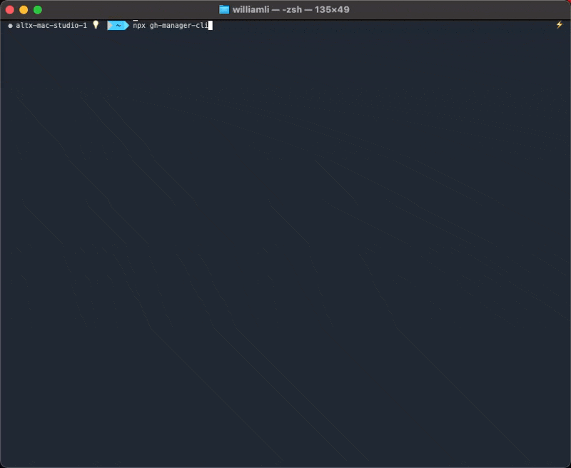
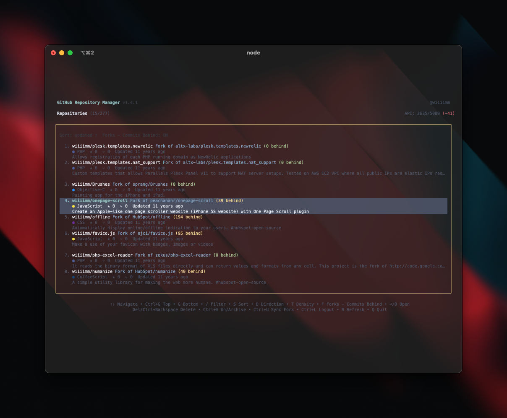
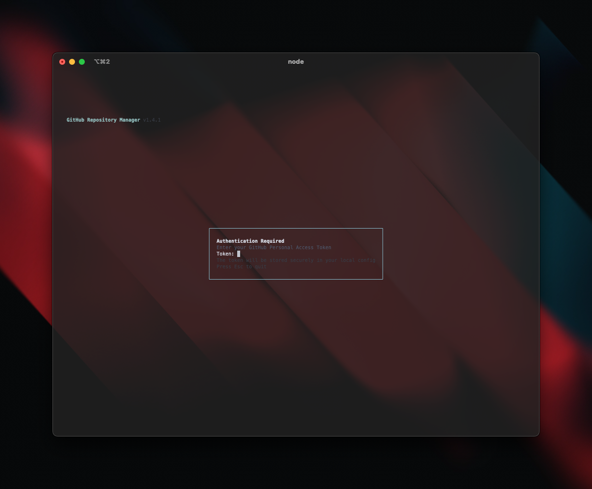
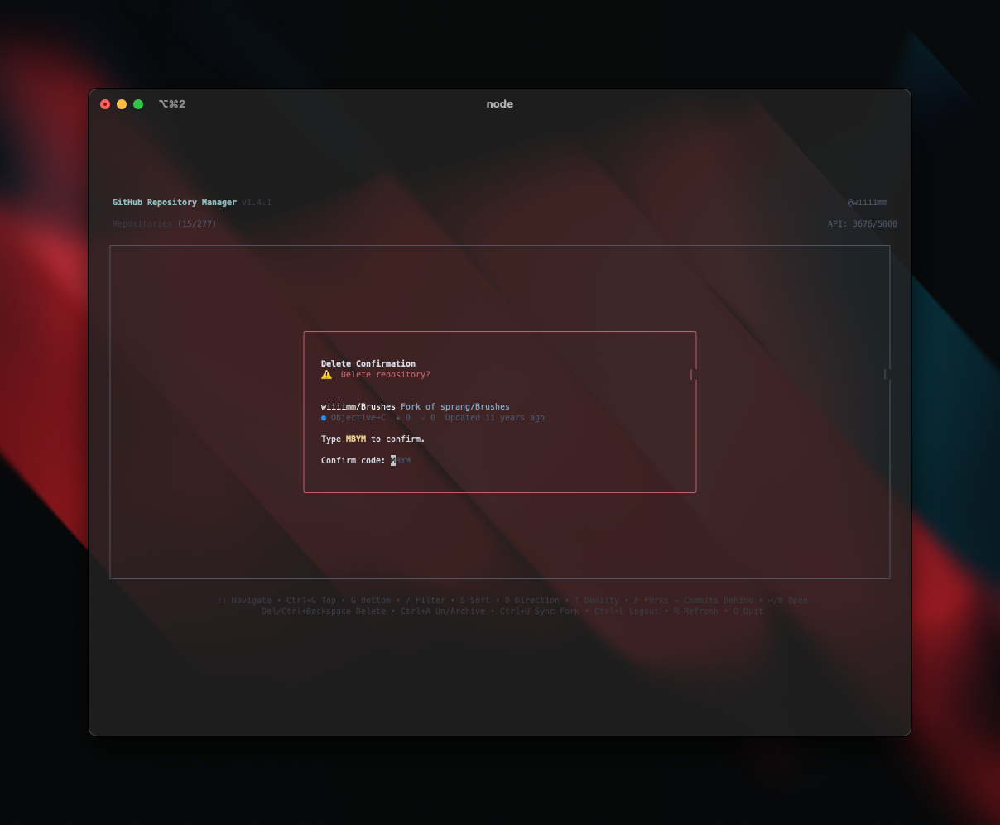

# gh-manager-cli

[](https://www.npmjs.com/package/gh-manager-cli)
[](https://github.com/wiiiimm/gh-manager-cli/releases)
[](https://opensource.org/licenses/MIT)
[](https://nodejs.org)
[](https://github.com/wiiiimm/gh-manager-cli/stargazers)
[](https://www.anthropic.com)
[](https://openai.com)

Interactive terminal app to browse and manage your personal GitHub repositories. Built with Ink (React for CLIs) and the GitHub GraphQL API.

<p align="center">
  
  <br />
  <em>Fast, keyboard-first GitHub repo management from your terminal</em>
 </p>

## Screenshots

<div align="center">
  
  
  
  <br />
  <sub>Listing • Auth • Delete confirmation</sub>
</div>

## Documentation

- [Installation](Installation.md) - How to install gh-manager-cli
- [Features](Features.md) - Core features and capabilities
- [Usage](Usage.md) - How to use the CLI and keyboard shortcuts
- [Token & Security](Token-and-Security.md) - Authentication and security information
- [Development](Development.md) - Development workflow and technical details
- [Troubleshooting](Troubleshooting.md) - Common issues and solutions
- [Roadmap](Roadmap.md) - Upcoming features and enhancements

## Quick Start

```bash
# Run with npx (no install)
npx gh-manager-cli
```

On first run, you'll be prompted for a GitHub Personal Access Token.

